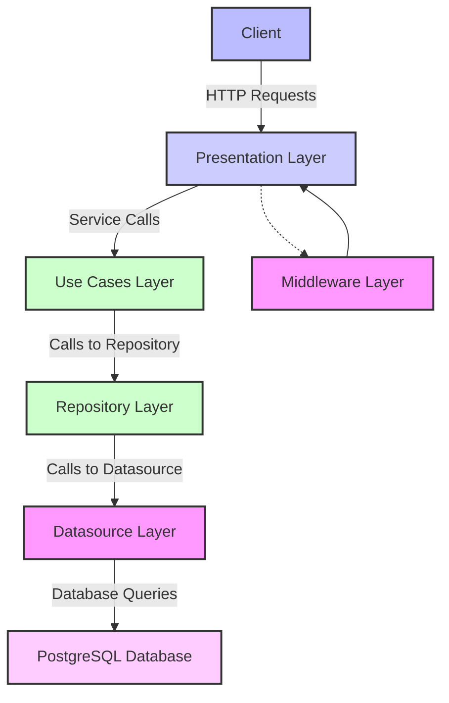

# Proyecto Node.js con Docker, PostgreSQL, Express y TypeScript

Este proyecto es una aplicación backend construida con Node.js, Express, PostgreSQL y TypeScript. Se utiliza la arquitectura limpia (Clean Architecture) para organizar el código de manera modular, separando las reglas de negocio, aplicación e infraestructura.

## Tecnologías Utilizadas

- **Node.js**: Entorno de ejecución para JavaScript.
- **Express**: Framework web para Node.js.
- **Prisma**: ORM web conectarnos a la base de datos.
- **PostgreSQL**: Sistema de gestión de bases de datos relacional.
- **TypeScript**: Superconjunto de JavaScript que añade tipado estático.
- **Docker**: Para contenerizar la aplicación y facilitar su despliegue.

## Requisitos Previos

Antes de comenzar, asegúrate de tener instalados los siguientes programas:

- **Git**: Para clonar el repositorio.
- **Docker**: Para levantar los contenedores.
- **Docker Compose**: Para gestionar múltiples contenedores Docker.

## Instrucciones de Instalación

### 1. Clonar el Repositorio

Clona este repositorio en tu máquina local utilizando Git:

```bash
git clone https://github.com/WalterPrz/api_prueba_tecnica_tablero
cd api_prueba_tecnica_tablero

```

### 2. Configurar Variables de Entorno

Dentro del directorio raíz del proyecto, encontrarás un archivo llamado `.env.template`. Cópialo y renómbralo a `.env`:

```bash
cp .env.template .env
```

### 3. Levantar los Contenedores

Una vez configurado el archivo .env, puedes levantar los contenedores utilizando Docker Compose. Ejecuta el siguiente comando para construir y ejecutar los contenedores en segundo plano:

```bash
docker-compose up --build -d
```

### 4. Verifica la aplicación

Una vez que los contenedores estén en funcionamiento, abre tu navegador y dirígete a la siguiente URL para acceder a la documentación de la API:

http://localhost:4000/api-docs/

### 4. Importar en Postman

Si prefieres utilizar Postman para probar la API, puedes importar el archivo de colección de Postman que se encuentra en la carpeta postman. Para hacerlo:
Abre Postman.
Haz clic en "Importar" y selecciona el archivo api-collection.json ubicado en la carpeta postman del proyecto
Ahora podrás probar todos los endpoints de la API desde Postman


## Diagrama del proyecto


